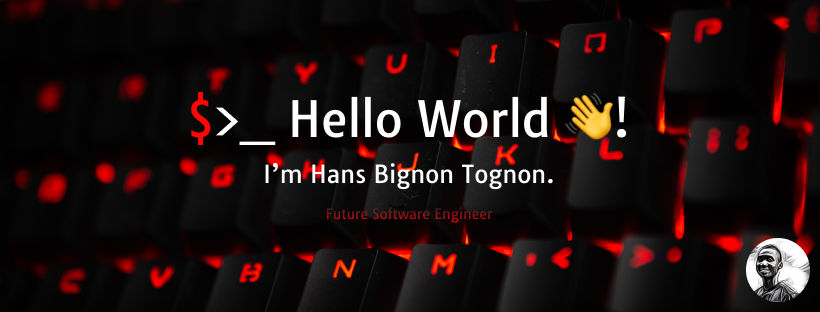

[](https://t.me/hanstobi) [](https://twitter.com/_tobihans)

## In a Nutshell
- 👤 21 y.o, freshly graduated in **Software Engineering**
- 🖤 loves dark mode, *Linux*, reading, games and family.
- 🌱 I’m currently learning a lot of ***Software Engineering*** and ***Data*** related stuffs :)
- 👯 I’m looking to collaborate on anything related to **.py**, **.ts** or **.rs** (code, in general)
- 🤔 I’m looking for help with contributing to Open Source in the right way
- 💬 Ask me about anything (I'll answer if possible)

### Languages & Tools
   

      

  

*And many more...*

### Coding activity (last 7 days)
<!--START_SECTION:waka-->

```python
Total Time: 36 hrs 19 mins

Python             16 hrs 35 mins  ███████████▒░░░░░░░░░░░░░   45.28 %
Rust               4 hrs 1 min     ██▓░░░░░░░░░░░░░░░░░░░░░░   10.96 %
Lua                3 hrs 50 mins   ██▓░░░░░░░░░░░░░░░░░░░░░░   10.50 %
TypeScript         3 hrs 18 mins   ██▒░░░░░░░░░░░░░░░░░░░░░░   09.04 %
Bash               1 hr 13 mins    ▓░░░░░░░░░░░░░░░░░░░░░░░░   03.33 %
Markdown           1 hr 12 mins    ▓░░░░░░░░░░░░░░░░░░░░░░░░   03.31 %
INI                1 hr 4 mins     ▓░░░░░░░░░░░░░░░░░░░░░░░░   02.93 %
Vue.js             39 mins         ▒░░░░░░░░░░░░░░░░░░░░░░░░   01.80 %
Text               35 mins         ▒░░░░░░░░░░░░░░░░░░░░░░░░   01.60 %
GraphQL            31 mins         ▒░░░░░░░░░░░░░░░░░░░░░░░░   01.42 %
```

<!--END_SECTION:waka-->
